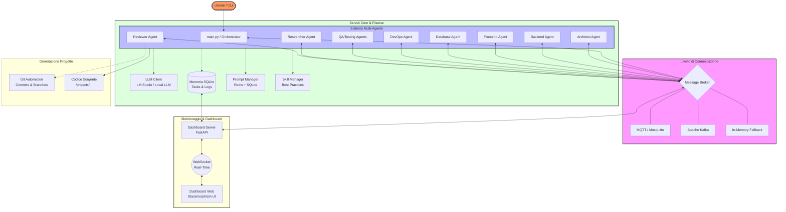
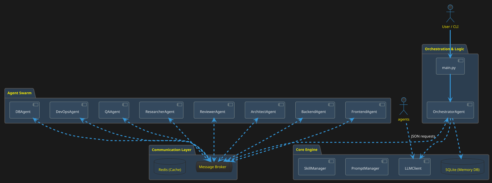

# 🏗️ Architettura di Sistema: Hypnonyx Multi-Agent

Questo documento descrive l'architettura tecnica di `Hypnonyx`, spiegando come gli agenti collaborano, come avviene la comunicazione e come vengono gestiti i dati e l'interfaccia di monitoraggio.

## 📊 Diagramma Architetturale (Mermaid)



## 📐 Schema Stile PlantUML



## 🖋️ Schema Visuale (Box-Drawing Style)

```text
┌─────────────────────────────────────────────────────────────────────────────┐
│                          USER / CLI INTERFACE (main.py)                     │
└───────────────────────────────┬─────────────────────────────────────────────┘
                                │
                                ▼
┌─────────────────────────────────────────────────────────────────────────────┐
│                         MESSAGE BROKER (Central Hub)                        │
│             (MQTT / Kafka / In-Memory Fallback System)                      │
└───────┬──────────┬──────────┬──────────┬──────────┬──────────┬──────────┬───┘
        │          │          │          │          │          │          │
        ▼          ▼          ▼          ▼          ▼          ▼          ▼
 ┌──────────┐┌──────────┐┌──────────┐┌──────────┐┌──────────┐┌──────────┐┌──────────┐
 │  ARCHI-  ││ BACKEND  ││ FRONTEND ││ DATABASE ││ DEVOPS   ││ RESEARCH ││ REVIEWER │
 │   TECT   ││  AGENT   ││  AGENT   ││  AGENT   ││  AGENT   ││  AGENT   ││  AGENT   │
 └────┬─────┘└────┬─────┘└────┬─────┘└────┬─────┘└────┬─────┘└────┬─────┘└────┬─────┘
      │           │           │           │           │           │           │
      └───────────┴───────────┼───────────┴───────────┴───────────┴───────────┘
                              │
                              ▼
┌─────────────────────────────────────────────────────────────────────────────┐
│                          CORE ENGINE & RESOURCES                            │
├──────────────────────┬──────────────────────┬───────────────────────────────┤
│    LLM CLIENT        │    MEMORY SYSTEM     │      PROMPT MANAGER           │
│ (LM Studio / API)    │ (SQLite / Markdown)  │     (Redis + SQLite)          │
└──────────┬───────────┴──────────┬───────────┴────────────┬──────────────────┘
           │                      │                        │
           ▼                      ▼                        ▼
┌──────────────────────┐┌──────────────────────┐┌─────────────────────────────┐
│   PROJECT OUTPUT     ││  DASHBOARD SERVER    ││      SKILL SYSTEM           │
│ (/projects/code)     ││ (FastAPI + WS)       ││   (.agent/workflows)        │
└──────────────────────┘└──────────┬───────────┘└─────────────────────────────┘
                                   │
                                   ▼
┌─────────────────────────────────────────────────────────────────────────────┐
│                        WEB MONITORING INTERFACE                             │
│                      (Kanban Board + Real-time Logs)                        │
└─────────────────────────────────────────────────────────────────────────────┘
```

## 🧩 Descrizione dei Componenti

### 1. Orchestrator & Agents

Il cuore del sistema è un'architettura basata su agenti specializzati:

- **Orchestrator**: Riceve l'input dell'utente, decompone il progetto in task atomici e monitora lo stato globale.
- **Agenti Operativi**: (Backend, Frontend, DB, etc.) eseguono i task assegnati comunicando via broker.
- **Reviewer Agent**: Agisce come "gatekeeper", validando il lavoro degli altri agenzie e fornendo feedback per ri-esecuzioni (retry).

### 2. Message Broker (MQTT / Kafka)

Gli agenti comunicano in modo asincrono tramite topic:

- `tasks.new`: Notifica di nuovi task disponibili.
- `tasks.assigned`: Conferma di presa in carico.
- `tasks.completed`: Risultato dell'esecuzione.
- `agent.heartbeat`: Monitoraggio dello stato di salute degli agenti.
- _Fallback_: Se nessun broker esterno è configurato, il sistema utilizza una coda in-memory.

### 3. Core Engine

- **LLM Client**: Gestisce le chiamate al modello linguistico (default: LM Studio) con logica di retry e parsing JSON robusto.
- **Memory System**: Utilizza SQLite per i dati strutturati (Task, Logs, Bug) e file Markdown per la memoria storica e le decisioni.
- **Prompt Manager**: Gestisce la versione dei prompt degli agenti, permettendo aggiornamenti dinamici senza riavviare il codice.

### 4. Dashboard & Monitoring

Un server FastAPI dedicato espone API per la dashboard:

- **WebSocket**: Notifica istantaneamente il frontend di ogni cambio di stato.
- **Kanban UI**: Permette una visualizzazione chiara dei task in `Pending`, `In Progress`, `Review` e `Completed`.

### 5. Git & Persistence

Ogni volta che un agente completa un task con successo, il sistema effettua automaticamente un commit Git con un messaggio strutturato, garantendo la tracciabilità completa di ogni riga di codice generata.
